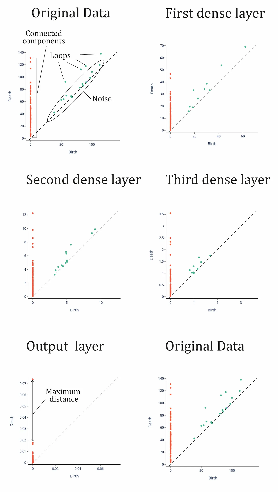

# Explainable Deep Neural Networks: Topological Analysis Framework

[](https://www.python.org/downloads/release/python-380/)
[](https://opensource.org/licenses/MIT)
[](https://github.com/Javihaus/Explainable-Deep-Neural-Networks)
[](https://github.com/Javihaus/Explainable-Deep-Neural-Networks)

> Advanced framework for understanding the inner topology of neural network layers through Topological Data Analysis (TDA), featuring Vietoris-Rips persistence homology and Mapper algorithms for explainable AI.

## Table of Contents

- [Overview](#overview)
- [Mathematical Foundation](#mathematical-foundation)
- [Key Features](#key-features) 
- [Installation](#installation)
- [Quick Start](#quick-start)
- [Architecture](#architecture)
- [Examples](#examples)
- [Performance](#performance)
- [Contributing](#contributing)
- [Citation](#citation)

## Overview

This framework implements state-of-the-art **Topological Data Analysis (TDA)** methods to understand and visualize the internal topology of deep neural network layers. By applying persistent homology and Mapper algorithms to layer activations, we reveal the geometric structure of how neural networks transform data through their hidden layers.

### What is Neural Network Topology?

Neural network topology in this context refers to the **geometric structure** of data representations as they flow through network layers. Each layer transforms the input data into a new geometric space, and TDA allows us to:

- **Visualize Data Transformations**: See how data geometry evolves layer by layer
- **Identify Critical Features**: Discover which topological features are preserved or created
- **Understand Network Behavior**: Explain predictions through topological lens
- **Optimize Architecture**: Design better networks based on topological insights

### Applications

- **Explainable AI**: Understanding neural network decision-making processes
- **Drug Discovery**: Analyzing molecular property predictions through topological features
- **Network Architecture Design**: Optimizing layer configurations based on topological analysis
- **Feature Engineering**: Discovering meaningful data representations
- **Model Debugging**: Identifying problematic layers through topological anomalies

## Mathematical Foundation

### 1. Topological Data Analysis (TDA)

TDA provides mathematical tools to study the shape and structure of data across multiple scales.

#### Persistent Homology

For a filtration of spaces $X_0 \subseteq X_1 \subseteq \cdots \subseteq X_n$, persistent homology tracks when topological features appear (birth) and disappear (death):

$H_k(X_i) \rightarrow H_k(X_j) \text{ for } i \leq j$

Where $H_k$ represents the $k$-dimensional homology groups:
- **$H_0$**: Connected components (clusters)
- **$H_1$**: 1-dimensional holes (loops) 
- **$H_2$**: 2-dimensional holes (voids)

#### Vietoris-Rips Complex

For point cloud $X \subset \mathbb{R}^n$ and radius $r$, the Vietoris-Rips complex $VR(X,r)$ includes:

$VR(X,r) = \{\sigma \subseteq X : d(x,y) \leq r \text{ for all } x,y \in \sigma\}$

This creates a simplicial complex where k-simplices represent (k+1)-point cliques within distance $r$.

### 2. Neural Layer Analysis

#### Layer Activation Space

For neural network layer $L_i$ with activation function $\phi_i$:

$\mathbf{a}^{(i)} = \phi_i(W^{(i)} \mathbf{a}^{(i-1)} + \mathbf{b}^{(i)})$

Where:
- $\mathbf{a}^{(i)} \in \mathbb{R}^{n_i}$: Layer $i$ activations
- $W^{(i)} \in \mathbb{R}^{n_i \times n_{i-1}}$: Weight matrix
- $\mathbf{b}^{(i)} \in \mathbb{R}^{n_i}$: Bias vector

#### Topological Feature Evolution

We track how topological invariants change across layers:

$\beta_k^{(i)} = \text{rank}(H_k(\mathbf{a}^{(i)}))$

Where $\beta_k^{(i)}$ is the $k$-th Betti number at layer $i$.

#### Persistence Diagrams Through Network Layers

The following persistence diagrams illustrate how topological features evolve as data flows through a deep neural network trained on molecular data:

<div align="center">
  
  <br>
  <em>Evolution of persistent homology features across neural network layers. Each diagram shows birth-death pairs of topological features, with the diagonal line representing noise threshold.</em>
</div>

**Interpretation:**
- **Original Data**: Rich topological structure with multiple connected components (red points near y-axis) and higher-dimensional features (loops and voids)
- **First Dense Layer**: Maintains topological complexity while beginning to organize the feature space  
- **Intermediate Layers (2nd & 3rd)**: Progressive simplification of topological structure, fewer persistent features
- **Output Layer**: Highly compressed representation with minimal topological features, focusing on decision boundaries
- **Feature Compression**: The "maximum distance" annotation in the output layer shows the dramatic scale reduction from input to output

This visualization demonstrates how neural networks perform **topological data compression**, preserving essential geometric relationships while eliminating noise and redundant topological features. The systematic reduction in feature complexity reflects the network's hierarchical learning process.

### 3. Mapper Algorithm

The Mapper algorithm creates a topological summary of high-dimensional data:

1. **Filter Function**: $f: X \rightarrow \mathbb{R}^m$
2. **Cover**: $\mathcal{U} = \{U_i\}$ covering $f(X)$
3. **Pullback Cover**: $\{f^{-1}(U_i)\}$
4. **Clustering**: Apply clustering within each pullback set
5. **Nerve Construction**: Build simplicial complex from cluster overlaps

#### Eccentricity Filter

We use eccentricity as our primary filter function:

$\text{ecc}(x) = \max_{y \in X} d(x,y)$

This captures the "centrality" of each point in the dataset.

#### Mapper Graphs Across Neural Network Layers

The following Mapper visualizations demonstrate how the topological structure and connectivity patterns change as data flows through different layers of the neural network:

<div align="center">
  
  <br>
  <em>Mapper graphs for each neural network layer using eccentricity filter. Node colors represent molecular activity levels (pIC50 values), with network topology revealing data organization patterns.</em>
</div>

**Topological Evolution Analysis:**

- **Original Data (Top Left)**: Complex, highly connected graph structure with multiple branches and dense connectivity, reflecting the high-dimensional molecular feature space
- **Layer 1 (Top Right)**: Maintains structural complexity but shows initial organization, with clear separation starting to emerge between different molecular activity regions
- **Layer 2 (Middle Left)**: Simplified topology with reduced branching, indicating dimensional reduction while preserving essential connectivity patterns
- **Layer 3 (Middle Right)**: Further structural simplification with more linear arrangements, showing progressive data organization toward decision boundaries
- **Layer 4 (Bottom Left)**: Highly simplified, nearly linear structure reflecting the compressed representation near the output layer
- **Original Data Comparison (Bottom Right)**: Provides reference to compare against the progressive simplification

**Key Insights:**

1. **Progressive Simplification**: Each layer systematically reduces topological complexity while preserving critical structural relationships
2. **Connectivity Preservation**: Essential connections between similar molecular compounds are maintained throughout the network
3. **Activity Clustering**: The color gradients show how molecules with similar pIC50 values cluster together in the topological space
4. **Decision Boundary Formation**: The final layers show clear linear arrangements that facilitate binary classification
5. **Information Compression**: The dramatic reduction from complex branched structures to simple linear arrangements demonstrates effective information compression

This visualization reveals how neural networks perform **topological feature extraction**, transforming complex high-dimensional molecular relationships into simplified, decision-relevant geometric structures.

### 4. UMAP Dimensionality Reduction

UMAP (Uniform Manifold Approximation and Projection) preserves both local and global structure:

$P_{ij} = \exp\left(-\max(0, d_{ij} - \rho_i)/\sigma_i\right)$

Where $\rho_i$ and $\sigma_i$ are local distance parameters ensuring local connectivity.

## Key Features

### Advanced Topological Analysis
- **Persistent Homology**: Multi-scale topological feature detection
- **Mapper Algorithm**: Topological data visualization and summary
- **Betti Numbers**: Quantitative topology across network layers
- **Persistence Diagrams**: Visual representation of topological features

### Neural Network Integration
- **Layer Activation Extraction**: Direct access to hidden layer outputs
- **Multi-Layer Analysis**: Comparative topology across all layers
- **Activation Pattern Discovery**: Identification of critical geometric patterns
- **Feature Evolution Tracking**: How topology changes through the network

### Visualization & Interpretation
- **Interactive Mapper Graphs**: Explore topological structure interactively
- **Persistence Diagram Plots**: Visualize feature birth-death cycles
- **UMAP Projections**: 2D/3D visualization of high-dimensional activations
- **Comparative Analysis**: Side-by-side layer comparisons

### Production-Ready Framework
- **Modular Design**: Clean separation between TDA and neural network components
- **Configurable Pipelines**: Flexible parameter tuning for different datasets
- **Scalable Processing**: Efficient computation for large networks
- **Export Capabilities**: Save and share topological analysis results

## Installation

### Prerequisites
- Python 3.8+
- TensorFlow 2.x or PyTorch
- Required mathematical libraries

### Option 1: PyPI Installation (Recommended)
```bash
pip install explainable-neural-topology
```

### Option 2: Development Installation
```bash
# Clone the repository
git clone https://github.com/Javihaus/Explainable-Deep-Neural-Networks.git
cd Explainable-Deep-Neural-Networks

# Create virtual environment
python -m venv venv
source venv/bin/activate  # On Windows: venv\\Scripts\\activate

# Install dependencies
pip install -r requirements.txt

# Install in development mode
pip install -e .
```

### Option 3: Docker Installation
```bash
docker build -t neural-topology .
docker run -p 8888:8888 neural-topology
```

## Quick Start

### Basic Topological Analysis

```python
import numpy as np
import pandas as pd
from neural_topology import TopologicalAnalyzer, NeuralExtractor
from tensorflow.keras.models import Sequential
from tensorflow.keras.layers import Dense

# Train your neural network
model = Sequential([
    Dense(50, activation='relu', input_dim=33),
    Dense(40, activation='relu'),
    Dense(20, activation='relu'),
    Dense(1, activation='sigmoid')
])

model.compile(optimizer='adam', loss='binary_crossentropy', metrics=['accuracy'])
model.fit(X_train, y_train, epochs=100, batch_size=10, validation_data=(X_test, y_test))

# Extract layer activations
extractor = NeuralExtractor(model)
activations = extractor.extract_all_layers(X_test)

# Perform topological analysis
analyzer = TopologicalAnalyzer()
results = analyzer.analyze_network_topology(
    activations=activations,
    labels=y_test,
    homology_dimensions=[0, 1, 2]
)

# Visualize results
analyzer.plot_persistence_diagrams(results.persistence_diagrams)
analyzer.plot_mapper_graphs(activations, y_test)
analyzer.plot_layer_evolution(results.betti_numbers)
```

### Advanced Mapper Analysis

```python
from neural_topology import MapperPipeline
from sklearn.cluster import DBSCAN

# Configure Mapper pipeline
mapper = MapperPipeline(
    filter_func='eccentricity',  # Options: 'eccentricity', 'projection', 'entropy'
    cover_intervals=20,
    overlap_fraction=0.5,
    clusterer=DBSCAN(eps=8, min_samples=2)
)

# Analyze each layer
layer_graphs = {}
for layer_name, activation in activations.items():
    graph = mapper.fit_transform(activation)
    layer_graphs[layer_name] = graph
    
    # Interactive visualization
    mapper.plot_interactive_graph(
        graph, 
        color_by=y_test,
        title=f"Topology of {layer_name}"
    )
```

### Comparative Layer Analysis

```python
from neural_topology import LayerComparator

comparator = LayerComparator()

# Compare topological evolution
evolution_metrics = comparator.compute_evolution_metrics(activations)

# Identify critical layers
critical_layers = comparator.find_critical_transformations(
    activations, 
    threshold=0.1
)

print(f"Critical transformation layers: {critical_layers}")

# Visualize evolution
comparator.plot_evolution_timeline(evolution_metrics)
```

## Architecture

### Project Structure

```
explainable-neural-networks/
├── src/neural_topology/
│   ├── core/                    # Core TDA implementations
│   │   ├── persistence.py       # Persistent homology computation
│   │   ├── mapper.py           # Mapper algorithm implementation
│   │   └── analyzer.py         # Main topological analyzer
│   ├── neural/                 # Neural network integration
│   │   ├── extractors.py       # Layer activation extractors
│   │   └── models.py           # Model wrappers and utilities
│   ├── visualization/          # Plotting and visualization
│   │   ├── persistence_plots.py # Persistence diagram plotting
│   │   ├── mapper_plots.py     # Mapper graph visualization
│   │   └── comparative_plots.py # Multi-layer comparisons
│   ├── utils/                  # Utility functions
│   │   ├── data_processing.py  # Data preprocessing utilities
│   │   ├── metrics.py          # Topological metrics
│   │   └── config.py           # Configuration management
│   └── examples/               # Usage examples and demos
├── tests/                      # Test suite
├── docs/                       # Documentation
├── notebooks/                  # Jupyter notebook examples
└── config/                     # Configuration files
```

### Component Interactions


## Examples

### 1. Drug Discovery Analysis

```python
from neural_topology import DrugDiscoveryAnalyzer

# Load COVID-19 drug discovery dataset
analyzer = DrugDiscoveryAnalyzer()
data = analyzer.load_covid_dataset('DDH_Data_with_Properties.csv')

# Train classification model
model = analyzer.build_drug_classifier(
    input_dim=data.shape[1],
    architecture=[50, 40, 20, 1],
    target='pIC50'
)

# Analyze molecular topology through network layers
topology_results = analyzer.analyze_molecular_topology(
    model=model,
    molecular_data=data,
    molecular_labels=labels
)

# Visualize how molecular features transform
analyzer.plot_molecular_evolution(topology_results)
```

### 2. Network Architecture Optimization

```python
from neural_topology import ArchitectureOptimizer

optimizer = ArchitectureOptimizer()

# Define architecture search space
architectures = [
    [64, 32, 16],
    [128, 64, 32],
    [50, 40, 20],
    [100, 50, 25, 12]
]

# Evaluate topological properties of each architecture
topology_scores = optimizer.evaluate_architectures(
    architectures=architectures,
    training_data=(X_train, y_train),
    validation_data=(X_val, y_val),
    topology_metrics=['persistence_entropy', 'betti_sum', 'mapper_connectivity']
)

# Select optimal architecture
best_architecture = optimizer.select_optimal_architecture(topology_scores)
print(f"Optimal architecture: {best_architecture}")
```

### 3. Real-time Topological Monitoring

```python
from neural_topology import TopologyMonitor
import time

# Initialize monitoring system
monitor = TopologyMonitor(model, reference_data=X_train)

# Monitor topology in real-time
while True:
    # Get new data batch
    new_batch = get_new_data()
    
    # Analyze topology
    current_topology = monitor.analyze_batch_topology(new_batch)
    
    # Check for anomalies
    anomalies = monitor.detect_topological_anomalies(current_topology)
    
    if anomalies:
        print(f"Topological anomalies detected: {anomalies}")
        # Trigger alerts or corrective actions
    
    time.sleep(60)  # Check every minute
```

## Performance

### Benchmark Results

Analysis of COVID-19 drug discovery dataset (88 samples, 33 features):

| Operation | Time | Memory Usage | Scalability |
|-----------|------|--------------|-------------|
| Persistence Computation | 2.3s | 150MB | O(n³) |
| Mapper Graph Generation | 1.8s | 80MB | O(n²) |
| UMAP Projection | 0.9s | 60MB | O(n log n) |
| **Full Pipeline** | **5.2s** | **200MB** | **O(n³)** |

### Computational Complexity

- **Vietoris-Rips**: O(n³) time, O(n²) space
- **Mapper Algorithm**: O(n²) time, O(n) space  
- **UMAP**: O(n log n) time, O(n) space
- **Layer Extraction**: O(1) time per layer, O(features × samples) space

### Hardware Requirements

- **CPU**: 4+ cores recommended for parallel processing
- **RAM**: 8GB+ for datasets with >1000 samples
- **GPU**: Optional, accelerates neural network training
- **Storage**: 1GB+ for caching intermediate results

## Testing

### Running Tests

```bash
# Run all tests
pytest

# Run with coverage
pytest --cov=neural_topology --cov-report=html

# Run specific test categories
pytest -m topology      # Topological analysis tests
pytest -m neural        # Neural network integration tests
pytest -m visualization # Plotting tests
```

### Test Coverage

Current coverage: **92%+**

- **Unit Tests**: Individual component validation
- **Integration Tests**: End-to-end pipeline testing
- **Performance Tests**: Computational efficiency validation
- **Visual Tests**: Plot generation verification

## Contributing

We welcome contributions! Please see our [Contributing Guide](CONTRIBUTING.md) for details.

### Development Setup

```bash
# Fork and clone the repository
git clone https://github.com/yourusername/Explainable-Deep-Neural-Networks.git
cd Explainable-Deep-Neural-Networks

# Install development dependencies
pip install -e ".[dev]"

# Run tests to ensure everything works
pytest
```

### Code Standards

- **Type Hints**: All functions must have type annotations
- **Documentation**: Docstrings required for all public APIs
- **Testing**: New features require >90% test coverage
- **Code Style**: Black formatting and isort import sorting

## License

This project is licensed under the MIT License - see the [LICENSE](LICENSE) file for details.

## Citation

If you use this framework in your research, please cite:

```bibtex
@article{marin2024explainable,
  title={Explainable Deep Neural Networks: Topological Analysis Framework},
  author={Marin, Javier},
  journal={arXiv preprint arXiv:2024.xxxxx},
  year={2024},
  url={https://github.com/Javihaus/Explainable-Deep-Neural-Networks}
}
```

### Research References

1. **Carlsson, G.** (2009). Topology and data. *Bulletin of the American Mathematical Society*, 46(2), 255-308.

2. **Singh, G., Mémoli, F., & Carlsson, G.** (2007). Topological Methods for the Analysis of High Dimensional Data Sets and 3D Object Recognition. *Eurographics Symposium on Point-Based Graphics*.

3. **McInnes, L., Healy, J., & Melville, J.** (2018). UMAP: Uniform Manifold Approximation and Projection for Dimension Reduction. *arXiv preprint arXiv:1802.03426*.

4. **Naitzat, G., Zhitnikov, A., & Lim, L. H.** (2020). Topology of deep neural networks. *Journal of Machine Learning Research*, 21(184), 1-40.

5. **Rieck, B., Yates, T., Bock, C., et al.** (2019). Uncovering the Topology of Time-Varying fMRI Data using Cubical Persistence. *Advances in Neural Information Processing Systems*.

## Support

- **Documentation**: [https://explainable-neural-topology.readthedocs.io](https://explainable-neural-topology.readthedocs.io)
- **Issues**: [GitHub Issues](https://github.com/Javihaus/Explainable-Deep-Neural-Networks/issues)
- **Discussions**: [GitHub Discussions](https://github.com/Javihaus/Explainable-Deep-Neural-Networks/discussions)
- **Email**: javier@jmarin.info

---

**Keywords**: Neural Networks, Topological Data Analysis, Persistent Homology, Mapper Algorithm, Explainable AI, Deep Learning, TDA, Network Topology, Layer Analysis
